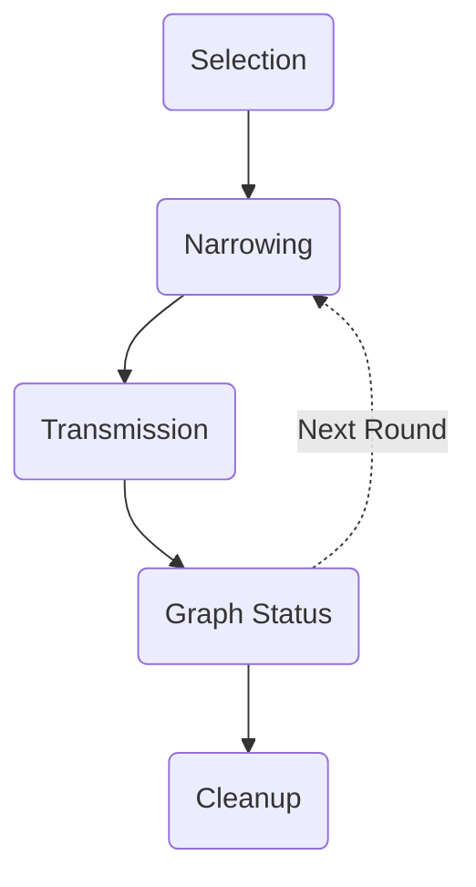
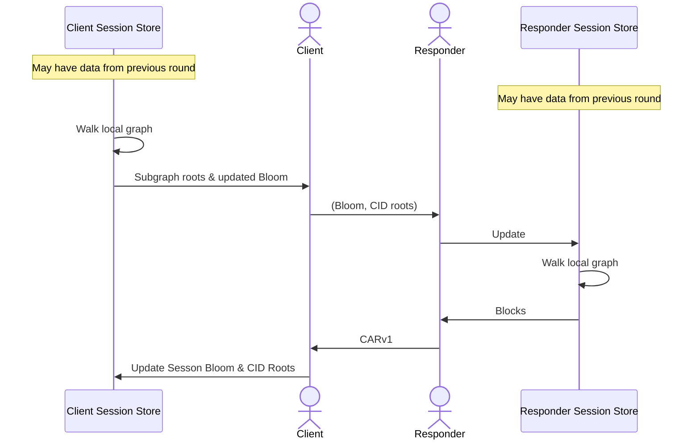
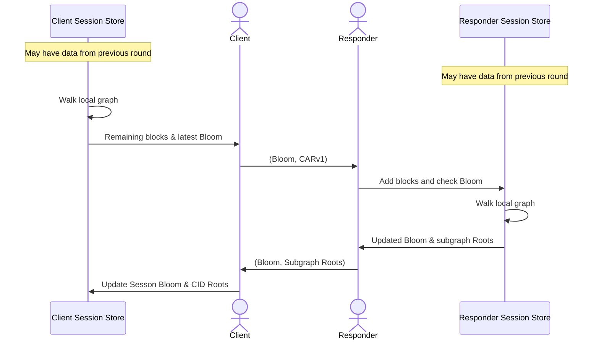

# CAR Mirror v0.1.0

> Objects in the CAR Mirror are closer than they appear
>
> -- [Quinn Wilton]

## Editors

* [Brooklyn Zelenka], [Fission]

## Authors

* [Brooklyn Zelenka], [Fission]
* [Philipp Krüger], [Fission]
* [James Walker], [Fission]

## Language

The key words "MUST", "MUST NOT", "REQUIRED", "SHALL", "SHALL NOT", "SHOULD", "SHOULD NOT", "RECOMMENDED", "NOT RECOMMENDED", "MAY", and "OPTIONAL" in this document are to be interpreted as described in [BCP 14] when, and only when, they appear in all capitals, as shown here.

# 0 Abstract

CAR Mirror describes a method for efficiently diffing, deduplicating, packaging, and transmitting [IPLD] data from a source node. The two primary advantages of CAR Mirror are the reduction in network round trips versus [Bitswap], and probabilistically excluding redundant blocks from being transferred. The protocol aims to be easy to implement for clients, whether or not they have a complete [libp2p] network stack.
 
# 1 Introduction

[IPLD] is structured as a Merkle DAG, which closes authentication over some rooted structure, but gives no help in determining what might be contained in it without actually walking the nodes. The naive approach for deduplicated synchronization on deep DAGs requires a large number of round trips as children are discovered at each level. Not packaging up the entire structure into one request is motivated by deduplication: the recipient may already have many of the blocks, and transferring them would be redundant. This situation creates an apparent zero sum optimization problem between deduplication and round trips.

## 1.1 Motivation

This proposal resolves multiple major, persistent challenges that numerous production [IPFS] operators have experienced. We believe the scope of this work to be an important stepping stone in the maturation of [IPFS], [Filecoin], and other [IPLD] data in production settings.

We propose extending the existing efforts to move specifically CAR files over HTTP (e.g. Filecoin point-to-point [CAR], [DSync]), and enable other transports such as [WSS], [HTTP/2 Streaming], and [WebRTC]. We know of several other projects in the broader ecosystem that would like to make use of this protocol, from storage providers and CDNs to decentralized social media protocols.

IPLD (and content addressing broadly) has an incredible advantage over conventional RESTful transfers: IPLD can easily deduplicate data. We strongly desire to retain this property. The [Web Native File System] is immutable-by-default, and often requires pushing small changes to a large, deeply-nested structure. Uploading many redundant gigabytes for a small change is not practical.

### 1.1.1 Round Trip Reduction

The default transfer protocol for IPFS ([Bitswap]) is very efficient for deduplication, but suffers when synchronizing large IPLD graphs due to the large number of round trips involved. This scales specifically with the depth of the diff in the requested graph. Discovering that a node is not available only occurs after many round trips.

Further, since Bitswap Want Lists are stateless, we have observed uploads and downloads stall mid-transfer when a peer is considered idle (or when many new peers connect), evicting the node from the peer list. With CAR Mirror, in both streaming and at-once delivery cases, it is well understood if the session is still open.

### 1.1.2 HTTPS & WSS Are Mature Transports

Streaming CAR files know that there is an open connection over a reliable, mature transport: HTTP, [HTTP/2 Streaming], and persistent [WSS]. Being able to efficiently push and fetch IPLD in CAR files over HTTP in particular means gaining the ability to move data over a mature, absolutely ubiquitous transport on privileged ports.

Relying on HTTP also makes TLS available everywhere, improving the security and privacy of messages. Since the proposed protocol does not depend on the public DHT (see Scope section), this provides some improvement even with public providers. The lack of dependence on the public DHT is well suited to short-lived nodes, such as browsers, GitHub Actions, and battery-sensitive devices such as mobile phones.

It is worth highlighting that HTTP is unable to support many P2P use cases, and many client devices are not directly dialable as data providers. Those use cases will need continued dependence on [WebRTC] and similar. These strategies can run entirely in parallel, and are in no way mutually exclusive. A node being undialable leads to some difficulty in the design of this system, but even under these conditions, CAR protocols can be constructed that perform better than the naive case.

### 1.1.3 Deduplication

The primary challenges are for efficient remote graph selection in absence of knowledge of the remote peer's data store. Avoiding sending redundant bytes over the wire is a tradeoff which Bitswap is on one end of. There is no perfect information-theoretic solution, so designing the alternate protocol is largely an exercise in optimization.

Many DAG-based projects have a strong real-world use case for deduplication: the [WebNative File System] is both eventually consistent and persistent-by-default (history is retained on update, like in Apple’s Time Machine). Thanks to the large amount of structural sharing, most of this structure is unchanged when performing a synchronization.

Deduplication in this scenario is now nontrivial. When pushing or fetching data, a node needs to know what is available locally and remotely, create a diff, package that up and send it. We propose using a Bloom filter to capture a snapshot of the local state relative to some CID, and send it to the remote. We then have a picture of what is different in its copy below that root. As we can only squeeze so much information into a message, this is then done in rounds/epochs if the request is not fulfilled in the first one.

### 1.1.4 Parallel Streams

Streaming data in true parallel from multiple sources is a very attractive feature of Bitswap. We aim to retain this property in CAR Pool with (likely) a combination of rendezvous hashing and intra-cluster communication of inverted (subtractive) counting bloom filters forming essentially a “session CRDT'' of provided CIDs. This is done both with single blooms, and across multiple epochs (which may happen eagerly in parallel).

## 1.2 Approach

The motivating insights are:

1. The Client often has information about the structure and content of the data it's requesting (e.g. an update to a directory)
2. Rounds and deduplication are not mutually exclusive; they're not even directly correlated! To put this another way: it's possible to sacrifice some deduplication accuracy to get a large reduction in the number of rounds.
3. In a multiple round protocol, approximate set reconciliation can be iteratively improved as more information is shared.

It would be impractical (and indeed privacy violating) for the provider to maintain a list of all CIDs held by the client. Sending a well tuned [Bloom filter] is size efficient, has a very fast membership check, and doesn't require announcing every block that it has.

IPLD provides opportunities for optimizing both latency and bandwidth. The goal of CAR Mirror is to merely do better than either pure Bitswap or pure uploads. There are steps that work with imperfect knowledge, but make a bet that the data will be useful to avoid a negotiation round ahead of sending blocks. CAR Mirror aims to keep the number of rounds low, while reducing the number of duplicated blocks.

The worst case scenario for CAR Mirror efficiency is exactly [DSync]. This is already an improvement over Bitswap, but narrowing the sync space has the potential to continually improve efficiency at the limit.

### 1.2.1 Constraints

> The limitation of local knowledge is the fundamental fact about the setting in which we work, and is a very powerful limitation
>
> -- Nancy Lynch, [A Hundred Impossibility Proofs for Distributed Computing]

CAR Mirror makes few assumptions about network topology, prior history, availability, or transport. This protocol makes a cold start assumption. While CAR Mirror can do better with more state, it is stateless by default: peers assume that any information that they have about each other from previous interactions is out of date and heuristic at best. CAR Mirror is unicast and unidirectional (source-to-sink).

The Bloom filter introduces new overhead not present in Bitswap. This cost is amortized over the typical reduction in round trips, though for very simple cases (such as sending a single block), it is possible that this overhead is not paid back. The size of the Bloom filter is kept to a minimum, and tuned on heuristic factors. CAR Mirror has the greatest gains on deep trees, and very shallow trees generally work well in Bitswap.

CAR Mirror is not a discovery protocol; it assumes that the provider has (at least some) of the required data. The efficiency gains are purely in reducing the number of round trips; it is completely agnostic about the existence of a DHT.

Transmitting complete information about very large block stores is not practical. Further, a Server will typically have a much larger number of blocks than a Client. Narrowing the problem space down is required in the majority of cases, which can take advantage of any number of heuristics. As such, finding ways to narrow the problem space is critical.

### 1.2.2 Scope

Our strategy is to build as much on top of existing libp2p technologies as possible, extended with three things:

* A CAR-based HTTP API for arbitrary DAGs in Kubo (go-ipfs)
* Store reconciliation (remote differential graph selection)
* Parallel streaming from multiple cooperative peers

Note that this does not include general DHT discovery or connection. Further work may involve peer discovery with ad hoc inclusion to the CAR Pool cluster, but would require additional protocols. Our strategy is to ship an immediately impactful protocol into Kubo, which the scope here manages the 90th percentile use case that we have seen in practice. We are happy to scope out the broader DHT provider upon request.

# 2. Concepts

## 2.1 Roles

| Role   | Dialable | On Push  | On Pull  |
|--------|-----------|----------|----------|
| Client | Maybe     | Sender   | Receiver |
| Server | Yes       | Reciever | Sender   |

Note that client/server MAY be applied in peer-to-peer contexts between capable machines. In these contexts, they merely assume these roles on a per-request basis.

### 2.1.1 Client

The Client is the node that starts the session. This will be either the sender or receiver, depending on the direction of data flow.

### 2.1.2 Server

The Server is the node that will fulfill the data request, either by providing storage or supplying the requested blocks.

### 2.1.3 Sender

The Sender is the node that has the data, and is pushing it to the other node.

### 2.1.4 Receiver

The Receiver is the node that is pulling data from the other node.

### 2.1.5 Dialable

Whether a peer can initiate contact with a particular node. For example, a web browser is not typically directly dialable.

## 2.2 CAR

[Content Addressable aRchive (CAR)][CAR] is a format similar to the [TAR] file modified to work efficiently on IPLD data. This specification uses [CARv1].

## 2.2.1 Streaming CAR

A CAR file can be expressed as a streaming data structure, and transmitted over [HTTP/2 Streaming], [WebSockets][WSS] or similar.

## 2.3 Session

A session is made up of several rounds. Each round involves the Client contacting the Server. Both parties MAY maintain stateful information between rounds as part of the session. The purpose of this session information is to aid in deduplication, completion, and cleanup.

### 2.3.1 Deduplication

A benefit of content addressing is deduplication. CAR Mirror deduplicates blocks across both parties to avoid putting redundant data over the wire. To achieve deduplication, the Client shares a Bloom filter with the Server containing an estimate of blocks that are possibly shared. This is an imprecise measure, though it does significantly better than sending duplicate blocks on the average case.

### 2.3.2 Stragglers

Stragglers are the opposite of deduplicated blocks: they are missing. This is typically caused by false positives on the Bloom filters. As such, this protocol is biased towards stragglers.

Each round of communication will have fewer stragglers. There is a degenerate case where the Server only matches on the roots, but omits everything from the Bloom filter. This situation is roughly equivalent to Bitswap, but with the overhead of Bloom filters. In such cases, the Client MAY omit the Bloom filter and request specific CIDs only. This is called the "cleanup" phase. It is possible that after a few rounds, this process becomes "unstuck" and the Bloom becomes useful again.

# 3. Transport

The protocol here is described in discrete rounds. When run over fully bidirectional transports such as [WSS], portions of rounds may be updated live rather than waiting for an arbitrary "round" to complete. Unidirectional transports like HTTP proceed in clear, distinct rounds. Discrete rounds are given below both because many transports require this mode, and because it is easier to explain in structured steps, even if not a hard requirement.

## 3.1 Phases

### 3.1.1 Selection

The first step is always deciding which graph to mirror, referenced by its root or roots.

### 3.1.2 Narrowing

Narrowing involves various heuristics to narrow the sync space to minimize the number of duplicate blocks sent. The goal is to reduce the amount of redundant bandwidth and number of communication rounds.

It is not possible to do a perfect job of narrowing asynchronously. Even if both parties operate with each other in synchronous rounds, they make no claims about what is being sent from other peers, garbage collection, corruptions, or cold starts.

The worst-case for narrowing is the inability to narrow the problem at all. In this case, the only information shared between the peers is the CID to be synced. There are 3 possible strategies for this scenario:

1. Maximal rounds, low duplication risk. Essentially Bitswap.
2. One round, high duplication risk. Essentially DSync.
3. Starting with a "cold call" (transfer initial round) and see if this transfer reveals more information.

By analogy, the third option above is a little like playing Sudoku or Minesweeper. Each round has the potential to reveal more information about the other peer's state, improving the ability to make smarter choices about what to put on the wire.

### 3.1.3 Transmission

The actual transfer of blocks is via a CARv1. This may be streaming, or a discrete file.

#### 3.1.3.1 Cold Calls

This protocol opts for kick starting worst-case narrowing with a "cold call" round. This keeps the transferred blocks as shallow in the graph as possible to avoid sending a large number of duplicate blocks. Once this round is complete, the other party has an opportunity to respond with information relevant to the set reconciliation.

### 3.1.4 Graph Status

Periodically -- at the end of the file or every $n$ streamed blocks -- the Receiver sends a list of unsynchronized subgraph roots: the bottom of the currently synced graph with unsynchronized children. The Server also sends a Bloom of blocks that it thinks may be discovered as duplicates.

### 3.1.5 Cleanup

The cleanup phase falls back to a slower but more accurate strategy. In this phase, any blocks that were missed due to Bloom false positives are found, explicitly enumerated, and transmitted up. The idea is that there will only be a handful (if any) stragglers to clean up, and a low chance that they will be deeply nested. At this stage, the peers MAY switch to Bitswap to fulfill these requirements.

## 3.2 Pull Protocol 📥

### 3.2.1 High Level

For each round, the Client OPTIONALLY creates a Bloom filter with all leaf and interior CIDs for the nodes suspected to be shared with the structure that it is pulling. It sends this Bloom and the top CIDs to the Server.

In turn, the Server initializes a fresh CAR file, which MAY be streaming. The Server maintains a session CID memoization table (such as a hash set). It performs graph traversal on its local store, starting from the first requested CID. Absent any other information, preorder traversal is RECOMMENDED. However, an implementation MAY choose another strategy, for instance if it knows that certain blocks will be preferred first.

Any available graph roots MUST be sent as an array (`[CID]`) by the Client, regardless of the Client's Bloom filter. These form the basis of subquery anchors in the session.

Every CID visited is added to the Server's internal memoization table. Each Server block is matched against both the Client Bloom filter and the Server's session cache. If a block is found in either structure, it is RECOMMENDED that the Server exclude it from the payload, and stop walking that path. Once the relevant graph has been exhausted, the Server closes the channel.

On receipt of each block, the Client adds the block to its local store, and to its copy of the Bloom. If the Bloom crosses a saturation point, the Client MUST resize it before the next round.

At the end of each round, the Client MUST inspect its graph for any missing subgraphs. If there are incomplete subgraphs, the Client begins again with the roots of the missing subgraphs. If the Server fails to send a root, the Requester marks it as unavailable from that Server. The Client excludes unavailable roots from future rounds in the session.

If the Server begins returning only the requested roots but no other blocks, the Client MAY initiate a cleanup round. A cleanup phase merely omits the Bloom filter from the request. It is akin to a point-to-point Bitswap Want List, and performs best when there is a large number of subgraph roots with the expectation of no child nodes.

The Client MAY garbage collect its session state as soon as it has all of the blocks for the structure, minus the subgraphs marked as unavailable. It is RECOMMENDED that it keep this data indexed by the `peerId` of the Server and root CID from the request, so that it can use this information in future requests.

The Server MAY garbage collect its session state when it has exhausted its graph, since false positives in the Bloom filter MAY lead to the Server having an incorrect picture of the Client's store.  In addition, further requests MAY come in for that session. Session state is an optimization, so treating this as a totally new session is acceptable. However, due to this fact, it is RECOMMENDED that the Server maintain a session state TTL of at least 30 seconds since the last block is sent. Maintaining this cache for long periods can speed up future requests, so the Server MAY keep this information around to aid future requests.

## 3.2.2 Individual Round Sequence Diagram

## 3.3 Push Protocol 📤

### 3.3.1 High Level

The push protocol is very similar to pull (§3.2), roughly inverted. The major difference aside from direction of data flow is that the first round MAY be a "cold call". This prioritizes starting the first round with zero information about the Server, under the assumption that the first branch of the graph will either not contain many duplicate blocks, or if it does that it is doing as well as the prior art CAR transfers. This strategy prioritizes limiting round trips over reducing bandwidth.

The sending Client begins with a local phase estimating what the Server has in its store. This estimate is called the Server Graph Estimate. This may be from stateful information (e.g. Bloom filters and CIDs) learned in a previous round, or by using a heuristic such as knowing that the provider has a previous copy associated with an IPNS record or DNSLink. If no information is available, the estimate is the empty set.

The Client performs graph traversal of the data under the CID to push, appending blocks to a CAR file. This CAR MAY be discrete or streaming, depending on the transport. All other factors being equal, breadth-first traversal is RECOMMENDED. Since the Server is not expected to use the data immediately, it exposes the largest number of roots, and thus grants the highest chance of discovering shared subgraphs. An implementation MAY choose a different traversal strategy, for example if it knows more about the use.

On a partial cold call, the Server Graph Estimate MUST contain the entire graph minus CIDs in the initial payload. The Server MUST respond with a Bloom filter of all CIDs that match the Server Graph Estimate, which is called the Server Graph Confirmation. On subsequent rounds, the Server Graph Estimate continues to be refined until it is empty or the entire graph has been synchronized.

At the end of each round, the receiving Server MUST respond with a Bloom filter of likely future duplicates, and an array of CID roots for pending subgraphs. Either MAY be empty, in which case it is treated merely as an `ACK`.

On the next round, the Client checks each block against the filter, and begins appending them to the CAR and continuing on as normal.

## 3.3.2 Individual Round Sequence Diagram

## 3.4 Bloom Filter

### 3.4.1 Indexing

Indexes MUST be generated from hashes using the following strategy, based on whether or not the filter fits perfectly into a power of two ($2^c$). This is a single algorithm, but if the size of the Bloom filter is a power of two, rejection sampling MAY be omitted. Using a Bloom filter that is a power of two is RECOMMENDED since it avoids resampling.

NB: The Bloom filter's bucket order (index) MUST be interpreted big-endian and zero-indexed. All hashes generated for indexing MUST be interpreted as big-endian natural numbers.

#### 3.4.1.1 Power of Two

If the size $m$ of the filter is $d$ powers of two ($2^d$), take the lowest (rightmost) $d$ bits from the hash and interpret it as an index.

#### 3.4.1.2 Rejection Sampling

A Bloom filter MAY be a length that is not a power of two. This is NOT RECOMMENDED since it incurs [rejection sampling] overhead.

This case uses the nearest rounded power of two as described in the [Power of Two] section. If the sampled number is less than $m$, then it MUST be used as the index. If the number is larger, then right shift the unmasked number, take the required number of bits (e.g. via AND-mask) and check again. Repeat this process until the number of digits is exhausted.

If none of the samples succeed, a new hash MUST be generated and this process begun again. Hash generation MUST be performed via [XXH3] with the rehashing generation used as a seed (a simple counter, starting at 0).

For example, if the filter has 1000 bits, take the lowest 10 bits (max 1024). If the number is less than than 1000, use that number as the index. Otherwise, right shift and try again. If the bits have been exhausted, rehash the full value and begin the process again.

### 3.4.2 Optimization

The parameters for the Bloom are set by the Client. Many of the parameters are self-evident from the filter itself, but the number of hashes must be passed along in the initial request.

Optimizing Bloom filters depends on balancing false positive probability (FPP or $\epsilon$), filter size, number of hashes, hash function, and expected number of elements. This Bloom MUST use the deterministic hash function [XXH3]. 

It is RECOMMENDED to make the FPP one order of magnitude (OOM) under the inverse of the order of magnitude of the number of inserted elements. For instance, if there are some 100ks of elements in the filter, then the FPP should be $1/1M$. This can grow quickly, so an implementation MAY use another order of magnitude, such as the inverse of the OOM of the number of inserted elements.

The core idea of using a Bloom filter is that it is very fast and space efficient. For example, an optimal Bloom filter with 100k elements and a FPP of $10^{-6}$ can be expressed in a little over 350KB.

#### 3.4.2.1 Equations

Legend
* $n$: number of elements in the filter
* $m$: size of filter in bits
* $\epsilon$: false positive probability
* $k$: number of hash functions

Some [optimality equations][Bloom equations]:
* $k = {m \over n} \ln{2}$
* $m = -\frac{n \ln \epsilon}{(\ln 2)^2}$

A typical example looks like this:

* $n = 500\text{k}$
* $m \approx 1.8\text{MB}$
* $\epsilon \approx 1 \times 10^{-6}$
* $k = 20$

## 3.5 Similarity

As the entire data store of an arbitrary Client may be unbounded in size, the Bloom filter is populated with blocks that are likely to match based on semantic criteria or other heuristics.

The primary challenge in determining what information to send is that this protocol deals directly with the fact that knowledge in a distributed system is local.

### 3.5.1 Small Store

If a local store is on the order of 100,000s of blocks, then the entire store can reasonably be sent in the Bloom filter.

### 3.5.2 Randomized Saturation

In many cases -- importantly during cold calls -- a peer MAY not have enough information to fill a Bloom filter with relevant CIDs, or enough CIDs to fill out some minimum filter size (e.g. 1KB). In this case, it is RECOMMENDED that the Bloom be filled with random CIDs from the local store. While this may seem counterintuitive, this has the potential to reduce round trips in cases where the DAG being mirrored is deep rather than wide.

Since the false positive probability is an order of magnitude lower than the number of elements, this means that a path will typically be incorrectly omitted on the order of 1/1M or lower probability for a single round. The overall strategy of CAR Mirror is to do the best possible with limited information. Given that the pathological case where we have no matches other than the roots in a round (i.e. the lower bound for performance) looks similar to Bitswap, this tradeoff is generally biased towards attempting deduplication with random CIDs.

### 3.5.3 Mutable Pointer

A simple heuristic is on data updated from a mutable pointer, such as on [IPNS] or [DNSLink]. This often shares some structure, and thus the stale graph MAY be placed into the Bloom filter.

# 4. Caches

It is RECOMMENDED that CAR Mirror-enabled nodes maintain local caches of peer states, metadata about their own block stores, and memoization tables.

# 5. FAQ

## 5.1 Why use a classic Bloom filter?

There are many variants on Bloom filters that are used for similar problems in the literature, including the Invertible Bloom Filter, Distributed Bloom Filter, and HEX-BLOOM, among others. These all trade off size for the ability to synchronize multiple clients. CAR Mirror is a unicast source-to-sink protocol, thus the additional features of these structures are made redundant. An XOR-Filter or Cuckoo Filter are possible space optimizations for a future iteration, but classic Blooms are extremely simple and easy to reason about.

## 5.2 Privacy

There exist protocols for zero-knowledge set intersection (PSI) and union (PSU). In fact, some of these even use Bloom filters! Typically these protocols have a tradeoff on number of rounds, or at very least amount of system complexity. Since CAR Mirror is focused on transfer of data not in the intersection of two sets, this is of less value than in use cases such as contacts matching, privacy-preserving routing, and so on. In fact, we expect to explore this as part of CAR Pool to extend the federated model to an open protocol.

# 6. Acknowledgments

A big thank you to [Justin Johnson] for feedback on this spec, many suggestions on improving the readability, and writing the Golang implementation.

Thank you to [Quinn Wilton] for late night discussions on graph synchronization, error correction, Tornado codes, and alternate designs.

Thanks to [Brendan O'Brien] for the general encouragement for this scope of work, and for the prior art on [DSync].

<!-- Internal Links -->

[Power of Two]: #3411-power-of-two

<!-- External Links -->

[A Hundred Impossibility Proofs for Distributed Computing]: https://groups.csail.mit.edu/tds/papers/Lynch/podc89.pdf
[Bitswap]: https://docs.ipfs.io/concepts/bitswap/
[Bloom equations]: https://en.wikipedia.org/wiki/Bloom_filter#Optimal_number_of_hash_functions
[Bloom filter]: https://en.wikipedia.org/wiki/Bloom_filter
[Brendan O'Brien]: https://github.com/b5
[Brooklyn Zelenka]: https://github.com/expede 
[CAR]: https://ipld.io/specs/transport/car/
[CARv1]: https://ipld.io/specs/transport/car/carv1/
[DNSLink]: https://dnslink.io
[DSync]: https://pkg.go.dev/github.com/qri-io/dag/dsync
[Filecoin]: https://filecoin.io/
[Fission]: https://fission.codes
[HTTP/2 Streaming]: https://datatracker.ietf.org/doc/html/rfc7540#section-5
[IPFS]: https://ipfs.io
[IPLD]: https://ipld.io/
[IPNS]: https://docs.ipfs.io/concepts/ipns/
[James Walker]: https://github.com/walkah
[Justin Johnson]: https://github.com/justindotpub
[Philipp Krüger]: https://github.com/matheus23
[Quinn Wilton]: https://github.com/QuinnWilton
[TAR]: https://en.wikipedia.org/wiki/Tar_(computing)
[WSS]: https://datatracker.ietf.org/doc/html/rfc6455
[Web Native File System]: https://github.com/wnfs-wg/spec
[WebRTC]: https://datatracker.ietf.org/doc/html/rfc8835
[XXH3]: https://cyan4973.github.io/xxHash/
[libp2p]: https://libp2p.io/
[rejection sampling]: https://en.wikipedia.org/wiki/Rejection_sampling
